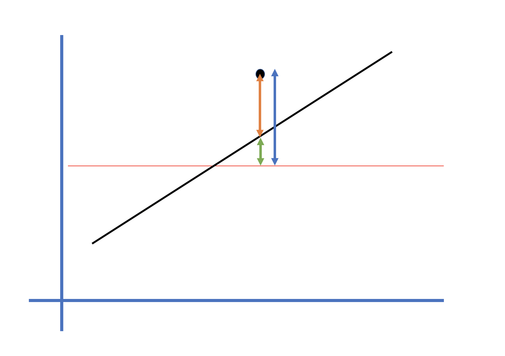

```{r message=F, echo=F}
library(dplyr)
library(ggplot2)
```

## Objectives

- You can do or understand at least one of the following goals

1. You can perform logistic regression using R
2. You can interpret the result of logistic regression (you can understand $\beta$ and $exp(\beta)$)

3. You can understand $R^2$ in linear regression
4. You can tell correlation coefficient from regression coefficient

## Youtube lecture on R

#### Logistic regression

[Lecture 11.1][11.1],   [Lecture 11.2][11.2],   [Lecture 11.3][11.3],   [Lecture 11.4][11.4],   [Lecture 11.5][11.5]

#### Online lecture
https://datascience-neurology.netlify.com/2019/08/23/online-r-lecture-youtube/

[11.1]: https://youtu.be/A5IPy0NuzD4

[11.2]: https://youtu.be/aUZNCO4GDfQ

[11.3]: https://youtu.be/-tM-RoI6tyI

[11.4]: https://youtu.be/L47AlLm9G78

[11.5]: https://youtu.be/zRBQ7C2LdOE

# Linear regression


## Motivation

```{r message=F, echo=F}
library(tidyverse)
library(ggplot2)
library(broom)
library(latex2exp)
```

```{r echo=FALSE}
db <- data.frame(x = c(2, 5),
                 y = c(5, 9))

ggplot(db, aes(x, y)) + geom_point(size = 4) +
  scale_x_continuous(limits = c(0, 10)) +
  scale_y_continuous(limits = c(0, 10)) + 
  theme_bw()
```


## Motivation

```{r echo=FALSE, warning=F}
db <- data.frame(x = c(2, 5),
                 y = c(5, 9))

ggplot(db, aes(x, y)) + geom_point(size = 4) +
  scale_x_continuous(limits = c(0, 10)) +
  scale_y_continuous(limits = c(0, 10)) + 
  theme_bw() +
  geom_smooth(method = "lm")
```

## Motivation

```{r echo=FALSE}
db <- data.frame(x = c(2, 3, 5),
                 y = c(5, 8, 9))

ggplot(db, aes(x, y)) + geom_point(size = 4) +
  scale_x_continuous(limits = c(0, 10)) +
  scale_y_continuous(limits = c(0, 10)) + 
  theme_bw() +
  geom_smooth(method = "lm")
```

## Linear regression: Ordinary least square method

<div style="text-align:center" markdown="l">



</div>

## Linear regression

- Dependent variable (continuous variable) can be explained by independent variables (continuous or categorical variables)

$$ y_i = \beta_0 + \beta_1 * x_1 + \epsilon_i$$
$$\hat{\beta_0} = \overline{y} - \hat{\beta_1}*\overline{x}$$
$$\hat{\beta_1} = \frac{\sum((x_i-\overline{x})*(y_i-\overline{y})}{\sum((x_i-\overline{x})^2)}$$

- Assumptions
    - $\epsilon_i \sim N(0, \sigma^2)$
    - Y: normal distribution
    - Y: equal  variance around the mean

## Sample size (rule of thumb)

- Multiple linear regression
    + > 20 subjects per independent variable
    
- Multiple logistic regression
    + > 10 outcomes per independent variable
    + Number of outcome is either Y = 1 or Y = 0 which is smaller
    
## How to perform linear regression

1. Draw plot
2. Perform regression test
3. Check the model fit
4. Check the $\beta$s
5. Check multicollinearity

## 3. Model fit

- 결정계수: coefficient of determination: $R^2$
    + squared correlation coefficient between $y_i$ and $\hat{y}$
    + how much variance of y can be explained by model.
    
- F test
    + $H_0$: all $\beta$s are 0
    
## Linear regression: Ordinary least square method

<div style="text-align:center" markdown="l">


</div>
 
## Objectives

- You can do or understand at least one of the following goals

1. You can perform logistic regression using R

2. You can interpret the result of logistic regression (you can understand $\beta$ and $exp(\beta)$)

~~3. You can understand $R^2$ in linear regression~~

~~4. You can tell correlation coefficient from regression coefficient~~

# Logistic regression

## Sigmoid function

$$S(t) = \frac{1}{1 + exp(-t)}$$

```{r echo=F}
x = seq(-10, 10, by = 0.01)
y = 1/(1+exp(-x))
ggplot(data.frame(x, y), aes(x, y)) + geom_line() +
  theme_bw()
```

## Logistic function

$$q(x) = \frac{L}{1 + exp(-k(x - x0))}$$
- logistic function: general form of sigmoid function


## Logistic function to logistic regression


$$f(x) = \frac{exp(\beta_0 + \beta_1*x_1)}{1 + exp(\beta_0 + \beta_1*x_1)}$$
```{r echo=F}
x = seq(-10, 10, by = 0.01)
y = exp(-x)/(1+exp(-x))
ggplot(data.frame(x, y), aes(x, y)) + geom_line() +
  theme_bw() +
  scale_x_continuous("beta_0 + beta_1*x_1")
```

## Logistic function to logistic regression

$$f(x) = \frac{exp(\beta_0 + \beta_1*x_1)}{1 + exp(\beta_0 + \beta_1*x_1)}$$

$$ln(Odds) = ln(\frac{f(x)}{1-f(x)}) = ln(\frac{P(Y=1)}{1-P(Y=1)}) = \beta_0 + \beta_1*x_1$$

- ln(odds) = logit

$$logit(p(x)) = ln(\frac{p}{1-p}) = \beta_0 + \beta_1*x_i + \epsilon_i$$


## OR (odds ratio)

$$ln(Odds) = ln(\frac{P(Y=1)}{1-P(Y=1)}) = \beta_0 + \beta_1*x_1$$

- if $x_1 = 1$

$$ln(Odds(x_1 = 1)) = \beta_0 + \beta_1$$

- if $x_1 = 0$

$$ln(Odds(x_1 = 1)) = \beta_0$$
<!-- - therefore, odds ratio is  -->

$$ln(\frac{Odds(x_1 = 1)}{Odds(x_1 = 0)}) = ln(Odds(x_1 = 1)) - ln(Odds(x_1 = 0)) = \beta_1$$

$$OR = exp(\beta_1)$$

## Objectives

- You can do or understand at least one of the following goals

1. You can perform logistic regression using R

2. You can interpret the result of logistic regression ~~(you can understand $\beta$ and $exp(\beta)$)~~

~~3. You can understand $R^2$ in linear regression~~

~~4. You can tell correlation coefficient from regression coefficient~~

## Logistic regression


- Dependent variable (categorical variable) can be explained by independent variables (continuous or categorical variables)
- Maximum likelihood estimation (cf> Ordinary least square method in linear regression)
  
<!-- - Very low $R^2$ -->

- Hosmer and Lemeshow Goodness of fit test
    + p > 0.05 means no evidence of poor fit.
    
- Nagelkerke $R^2$ : SPSS
- Cox-Snell $R^2$ : SAS and SPSS
    + https://statisticalhorizons.com/r2logistic

    
## Sample size (rule of thumb)

- Multiple linear regression
    + > 20 subjects per independent variable
    
- Multiple logistic regression
    + > 10 outcomes per independent variable
    + Number of outcome is either Y = 1 or Y = 0 which is smaller
    
## How to perform logistic regression

1. Check the variables and the number of event
2. Bivariate analyses
3. Perform regression test
4. Check the model fit
5. Check the $\beta$s
6. Check multicollinearity

## Import DB

```{r message=F}
library(MASS)
data("birthwt")
```

## 1. Check the variable

```{r}
table(birthwt$low)
```

---

```{r}
ggplot(birthwt, aes(x = lwt, y = low)) + geom_point()
```

---
```{r}
ggplot(birthwt, aes(x = factor(low), y = lwt, fill = factor(low))) + 
  geom_boxplot(alpha = 0.1) +
  geom_jitter(aes(color = factor(low)), alpha = 0.5) +
  theme_bw()
```

---
```{r}
ggplot(birthwt, aes(x =  lwt, fill = factor(low))) + 
  geom_density(alpha = 0.2) + theme_bw() +
  scale_fill_discrete("Low birth weight")
```

## 2. Bivariate analysis

- Dependent variable: categorical

- if independent variable: categorical
    + $\chi^2$ test
    + Fisher's exact test
    
- if independent variabls: continuous
    + Student's t test
    + Mann-Whitney or Wilcoxon rank sum test

## 3. Perform logistic regression

- birthwt shuuld not have missing  values.

```{r}

result <- glm(low ~ lwt + age + ht + smoke, data = birthwt,
    family = binomial)
```

## 4. Model fit

- Hosmer & Lemeshow goodness of fit
```{r}
library(ResourceSelection)
hoslem.test(result$y, fitted(result))
```

---

- Nagelkerke $R^2$

```{r}
library(fmsb)
NagelkerkeR2(result)
```

## 5. $\beta$ or $exp(\beta)$

```{r}
summary(result)
```

## formula

$$f(x) = \frac{exp(\beta_0 + \beta_1*x_1)}{1 + exp(\beta_0 + \beta_1*x_1)}$$

$$f(x) = \frac{exp(-0.02*lwt + 1.79*ht + 0.68*smoke)}{1 + exp(-0.02*lwt + 1.79*ht + 0.68*smoke)}$$

## Odds ratio

$$ln(Odds) = ln(\frac{P(Y=1)}{1-P(Y=1)}) = \beta_0 + \beta_1*x_1$$

$$ln(\frac{Odds(ht = 1)}{Odds(ht = 0)}) = ln(Odds(ht = 1)) - ln(Odds(ht = 1)) = 1.79$$

$$OR = exp(1.79) = 5.978418$$

## result of logistic regression

```{r}
coef(result)
exp(coef(result))
```

---

```{r}
confint(result)
confint(result) %>% exp()
```

## Objectives

- You can do or understand at least one of the following goals

1. You can perform logistic regression using R

~~2. You can interpret the result of logistic regression (you can understand $\beta$ and $exp(\beta)$)~~

~~3. You can understand $R^2$ in linear regression~~

~~4. You can tell correlation coefficient from regression coefficient~~

## 6. Multicollinearity

```{r warning=F, message=F}
library(car)
vif(result)
```
- vif > 2.5 problematic
- vif > 10 serious

---

```{r}
library(performance)
check_collinearity(result)
```

---

```{r}
x <- check_collinearity(result)
plot(x)
```

## Objectives

- You can do or understand at least one of the following goals

~~1. You can perform logistic regression using R~~

~~2. You can interpret the result of logistic regression (you can understand $\beta$ and $exp(\beta)$)~~

~~3. You can understand $R^2$ in linear regression~~

~~4. You can tell correlation coefficient from regression coefficient~~

<!-- ## Residuals -->

<!-- ```{r} -->
<!-- qqnorm(resid(result)) -->
<!-- qqline(resid(result), col = "red") -->
<!-- ``` -->

